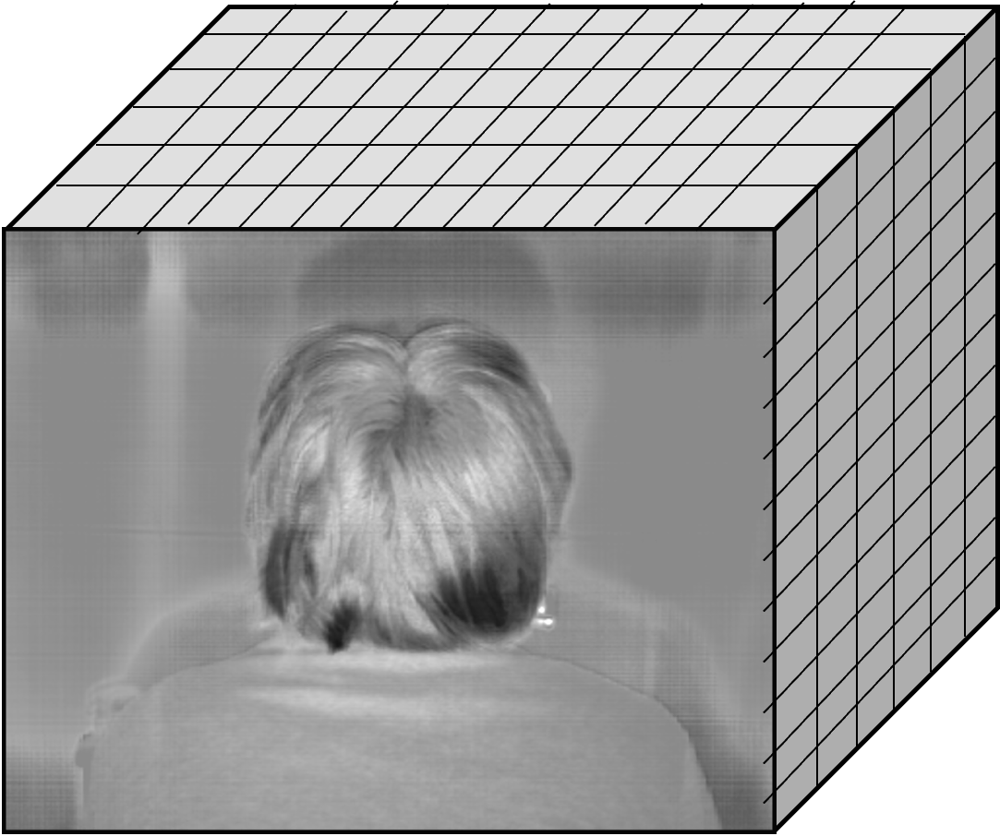
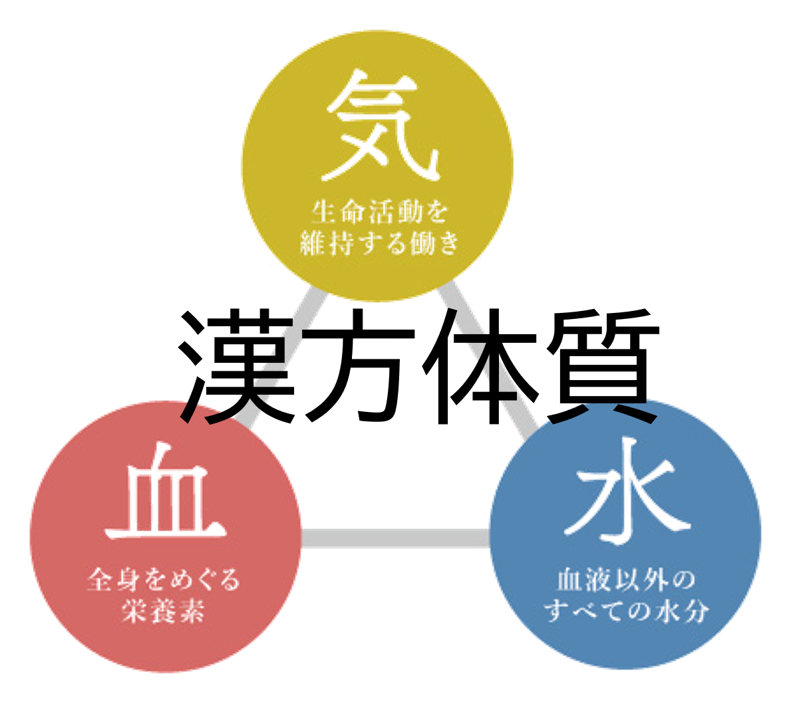
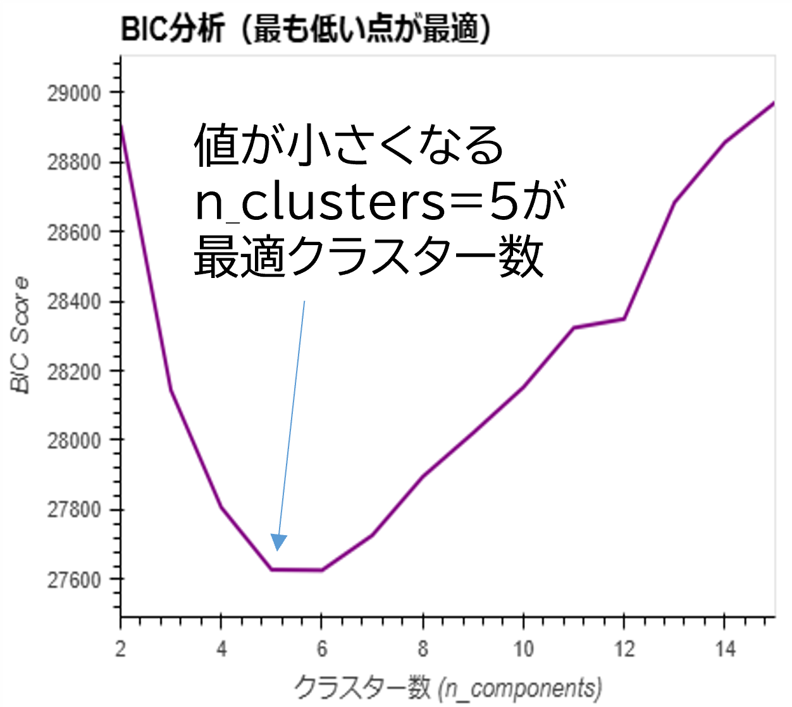

::: layout(title)
20260903
# NIR-HSIを用いた毛髪診断システムの開発
データサイエンスでひも解く漢方と毛髪の関係
礒辺真人
:::

---
## 目次

::: layout(agenda, 1)
1. 背景
2. 漢方体質アンケート
3. アンケート結果解析
4. 毛髪と漢方体質
5. 今後の展望と課題
:::

---
## 背景：漢方体質とは？気血水の基本概念
漢方医学では、人体は**「気」「血」「水」**の3要素がバランスよく巡ることで健康が保たれると考えられている。
::: grid(col=3, row=1)
::: card(yellow)
**気：生命エネルギー・代謝**
自律神経系や代謝を司る活力
- **気虚**: エネルギー不足・疲労・胃腸虚弱
- **気滞**: 気の滞り・抑うつ・膨満感
- **気逆**: 気の逆流・のぼせ・動悸
:::
::: split
::: card(red)
**血：血液・ホルモン・栄養**
全身に酸素や栄養を届ける働き

- **血虚**: 栄養不足・肌荒れ・貧血
- **瘀血**: 血行不良・冷えのぼせ
:::
::: split
::: card(blue)
**水：体液・リンパ・水分代謝**
血液以外の水分や分泌液
- **水滞 / 水毒**: 水分代謝異常・むくみ・めまい・頭重感
:::
:::

::: memo
**日本独自の発展（古方派）**：中国の思弁的な理論に対し、日本の江戸時代（吉益東洞ら）の実証的な漢方医学において、病態をシンプルに捉える指標として発展・体系化。
:::

---
## 背景: クラシエ × 漢方体質
- クラシエでは独自項目として、冷えに関する調査に加え**69項目の「寺沢式漢方体質診断アンケート」**を付帯調査として実施・データ蓄積。
- 弘前健診で取得したNIR-HSIのデータとクラシエ独自の漢方体質分類から見えることはあるのか？
- 漢方体質は毛髪へと発言するのか探索する。
::: images(2)


:::

::: point
本検討では、クラシエ独自の毛髪NIR-HSIのデータと漢方体質分類から見えることを探索する。
:::

---

## 目次
::: layout(agenda, 2)
1. 背景
2. 漢方体質アンケート
3. アンケート結果解析
4. 毛髪とアンケート
5. 今後の展開と課題
:::

---
## 漢方体質アンケート
2024年の弘前健診の漢方体質アンケート(69項目)をスコア化して足し合わせ、<br>
被験者ごとに６分類それぞれのスコアを割り振る。
::: grid(col=3, row=1)
::: card
**Stage1: 3段階回答**
|ID|項目1|項目2|・・・|項目69|
|:---:|:---|:---|---:|---:|
|1|1|2|・・・|1|
|2|2|3|・・・|2|
|・・・|・・・|・・・|・・・|・・・|
|1200|2|1|・・・|3|

各項目に対して「該当する：1」「たまに該当する:2」「該当しない:3」のように３段階で解答
:::

::: split
::: card
**Stage2: 重み付け**
|ID|項目1|項目2|・・・|項目69|
|:---:|:---|:---|---:|---:|
|1|気虚+0|水滞+3|・・・|血虚+1|
|2|気虚+1|水滞+1|・・・|血虚+2|
|・・・|・・・|・・・|・・・|・・・|
|1200|気虚+3|水滞+0|・・・|血虚+1|

項目ごとに６分類の重み付けスコアを付与
:::

::: split
::: card
**Stage3: スコア算出**
|ID|気虚|気滞|・・・|瘀血|
|:---:|:---|:---|---:|---:|
|1|25|14|・・・|5|
|2|31|21|・・・|12|
|・・・|・・・|・・・|・・・|・・・|
|1200|4|6|・・・|14|

各分類ごとに足し合わせて、体質スコアを算出
:::
:::


---
## アンケート解析
漢方**体質**と呼んでいるが、実際に体質と呼べるような分類があるのか？
アンケート結果にクラスタリングを実施し、被験者がどのような属性に分類できるのか。
各ステージごとに、GMM(クラスタリングの一種)→BIC/AICによるクラスター数の決定を実施。

::: point
::: grid(col=2:1)
* **GMM (混合ガウスモデル)**:
  データを確率分布の重なりとして捉える手法。K-Means（0か1かの二者択一）と異なり、「気虚60%・水滞40%」のような**体質のグラデーション（所属確率）を柔軟にモデル化**するのに適している。

* **BIC/AIC（ベイズ/赤池情報量規準）**:
  「データの当てはまり」と「シンプルさ」の**バランスを評価する統計指標**。細かく分けすぎる過学習にペナルティを与えるため、値の低い点が最も無理のない最適なクラスター数となる。
::: split

:::
:::


---

## 目次
::: layout(agenda, 3)
1. 背景
2. 漢方体質アンケート
3. アンケート結果解析
4. 毛髪とアンケート
5. 今後の展開と課題
:::

---
## 結果1-1. アンケート結果解析:(Stage1:条件決定)
前処理: 値の反転(数値が高いほど該当する) → StandardScaler → GMMClustering
:::grid(col=3,row=1)
::include("graph/outputs_stage1/01_questionnaire_68items/pca.html")::
::: split
::include("graph/outputs_stage1/01_questionnaire_68items/bic.html")::
::: split
::include("graph/outputs_stage1/01_questionnaire_68items/aic.html")::
:::

::: memo
- BIC / AIC ともに k=5 で谷を示し、クラシエ体質の分類数として妥当と判断。
:::

---
## 1-1. Stage1:アンケート結果解析:(Stage1:結果)
前提: 値の反転(数値が高いほど該当する) → StandardScaler → GMMClustering

::: grid(col=1:1)
::include("graph/outputs_stage1/01_questionnaire_68items/gmm_3d_biplot.html")::
:: split
|クラスタ|特徴|
|:---:|:---|
|0|全体的に良好（スコア低）|
|1|気虚・気滞優位|
|2|血虚・瘀血優位|
|3|水滞・むくみ優位|
|4|複合型（全般に高スコア）|
:::

::: memo
- PC0は全体的な不調度を示す。（どれか悪い人はどれも悪い）
- PC1,2,3で可視化すると、各軸・クラスタの特徴が明瞭に分離。
- 一部の項目（食欲と物事への興味、残尿感と舌が赤黒い、頭痛と月経など）で相関が取れていることが可視化可能。
:::


---
## 段階表示（ステップアニメーション）


キーボードの **[ → ]** または **[ Space ]** を押すと、1行ずつ順番に表示されます：

::: step
- 1番目の重要なポイント（クリックで出現）
- 2番目の詳細な説明（さらにクリックで出現）
- 3番目の結論・まとめ（最後にフェードイン）
:::

---

::: layout(chart-focus)
## 3Dデータ分析結果 (本編)
多次元データの可視化（マウス操作で360度回転・ズーム・ホバーが可能）

::include("charts/sample_3d.html")::
::: memo
- クラスタごとの空間的広がりと特異値の分布を直感的に把握可能。
- 💡 **キーボードの [ ↓ ] を押すと、下の詳細スライド（縦送り）へ進みます**
:::
:::

--

## 3Dデータ分析の補足 (縦送り詳細スライド)

::: grid(col=2, row=1)
### 月次推移の内訳 (2D)
- 縦送り（`--`）を使うと、本編の流れを邪魔せずに補足資料や詳細データを配置できます。
- キーボードの **[ ↑ ] で上のスライド**、**[ → ] で次の章**へ移動します。

::: split
::include("charts/sample_2d.html")::
:::

---

## 高度な表現力（数式 ＆ コード）

::: grid(col=2, row=1)
### 🧮 数式表示 (LaTeX / KaTeX)
正規分布の確率密度関数：
$$ f(x) = \frac{1}{\sigma \sqrt{2\pi}} e^{-\frac{1}{2}\left(\frac{x-\mu}{\sigma}\right)^2} $$

インライン数式も $E = mc^2$ のように書けます。

::: split
### 💻 コードハイライト
```python
def predict_roi(users, arpu, growth_rate):
    # リアルタイム試算ロジック
    monthly_rev = users * arpu
    return monthly_rev * (1 + growth_rate)
```
:::

---

## 機能比較表（Markdownテーブル）

| 比較項目 | 従来のPowerPoint | HTML次世代スライド |
|---|:---|:---|
| **グラフの操作性** | ❌ 静止画のみ | ⭕ **3D回転・ズーム・ホバー** |
| **オフライン配布** | ❌ PPTX専用ソフト必要 | ⭕ **ブラウザだけで単一HTML動作** |
| **バージョン管理** | ❌ バイナリで差分不明 | ⭕ **Git ＆ Markdownで完全管理** |
| **数式・コード** | ⚠️ 画像貼り付けが多い | ⭕ **LaTeX数式 ＆ シンタックス色分け** |

---

::: layout(summary)
## 今後の展開（3つの柱）
HTMLスライドを活用することで、データ分析結果の共有性とプレゼン体験が飛躍的に向上します。

::: card
### ① 迅速な共有
- 単一HTMLファイルで出力されるため、社内メールやチャットで即座に共有可能。
- サーバーや専用ソフトウェアのインストールが一切不要。
:::
::: card
### ② 柔軟なカスタマイズ
- MarkdownとCSS変数を書き換えるだけで、好みの配色に即座に変更可能。
- 目的別のレイアウトテンプレートで素早く資料作成。
:::
::: card
### ③ 描画力アップ
- Plotlyによる動的3D/2Dグラフで、説得力のあるプレゼン体験を提供。
- 会議中にその場でマウス回転・データ探索が可能。
:::
:::
